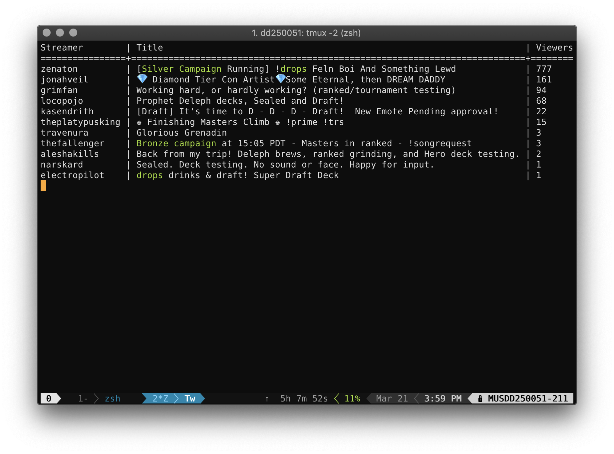
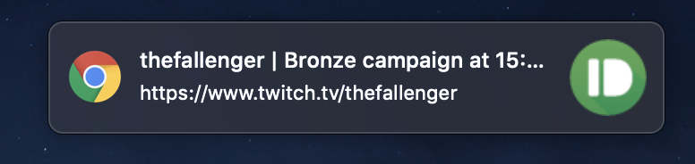

# Eternal Twitch Monitor Tool :gem:
This is a simple tool that periodically queries Twitch for a list of live streams
of the Eternal Card Game, prints the data to the screen, and notifies the user
when a new stream starts that matches configurable key words. It's handy for
alerting you when a new drop campaign starts so you don't miss out on those
tasty diamond drops. :gem:




## Getting Started
You'll need a Twitch client ID and a Pushbullet API access token.
> Instructions for obtaining a Twitch client ID can be found [here](https://dev.twitch.tv/docs/v5/#getting-a-client-id).

> Instructions for obtaining a Pushbullet API access token can be found [here](https://docs.pushbullet.com/v1/#http).

You'll also need an `etcd` cluster in order to run the service. Installation of `etcd` is out of the scope of this readme, but if you run the service in Docker, I've got you covered. The compose file is already configured to direct the service to the bundled `etcd` cluster.

Once you have collected the necessary information, update `conf/eternal_twitch.cfg` accordingly.

## Docker Installation
1. Run the containers
```bash
docker-compose up --build --detach
```

## Standard Installation

1. Create virtualenv
```bash
python3 -m venv .venv
source .venv/bin/activate
```

2. Install dependencies
```bash
pip install -r requirements.txt
```

3. Run the `eternal_twitch` service
```bash
python -m eternal_twitch
```

## Accessing the web UI
Once the service has been started, the web UI should become available at `http://localhost:5000`.